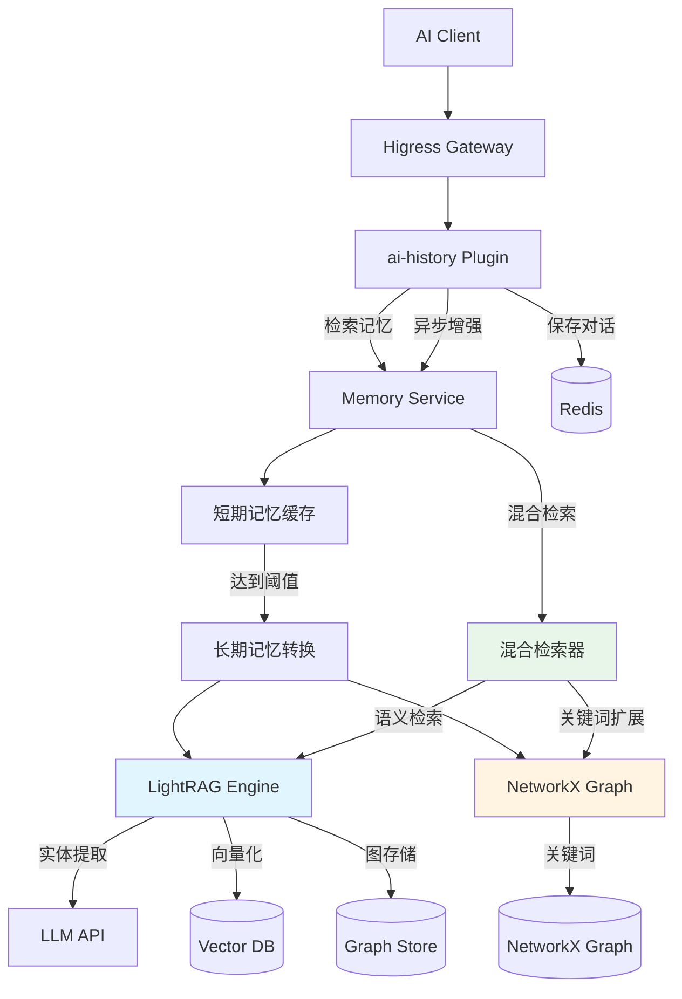
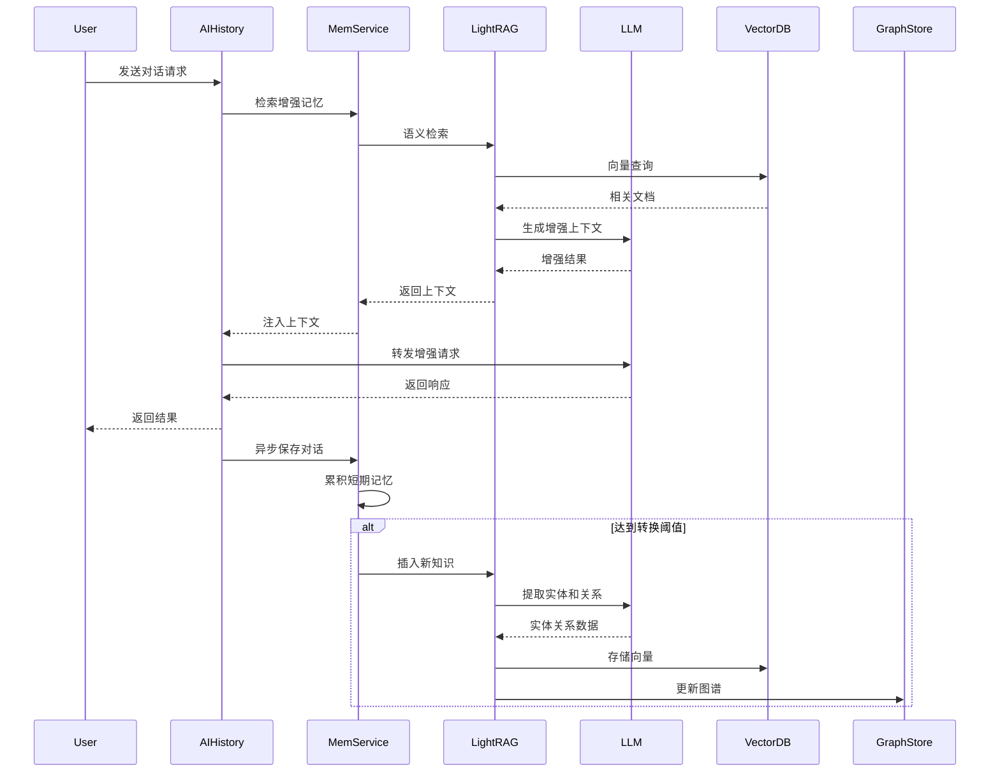

# LightRAG 集成方案 - 增强长期记忆系统

## 📋 方案概述

本方案详细说明如何在现有 Memory Enhancement Service 中集成 LightRAG，用于长期记忆的构建和检索，实现更智能的知识图谱和语义检索能力。

## 🎯 为什么选择 LightRAG

### LightRAG 核心优势

1. **双层检索架构**
   - 低层级：实体/关系级别的细粒度检索
   - 高层级：主题级别的粗粒度检索
   - 混合检索：结合两种策略获得最佳效果

2. **图增强生成**
   - 自动从文本中提取实体和关系
   - 构建知识图谱进行推理
   - 支持多跳查询和关联分析

3. **增量更新**
   - 支持动态添加新知识
   - 无需重建整个索引
   - 适合对话场景的持续学习

4. **高性能检索**
   - 向量化存储和快速检索
   - 支持混合搜索（向量+关键词）
   - 可扩展的索引结构

### 与现有 NetworkX 方案的对比

| 特性 | NetworkX 方案 | LightRAG 方案 | 混合方案 |
|------|--------------|---------------|----------|
| 关键词提取 | 简单分词 | LLM 提取实体 | ✅ LightRAG |
| 图谱构建 | 共现关系 | 实体关系图 | ✅ 两者结合 |
| 语义检索 | Jaccard 相似度 | 向量相似度 | ✅ LightRAG |
| 多跳推理 | 有限支持 | 原生支持 | ✅ LightRAG |
| 摘要生成 | 截断文本 | LLM 生成 | ✅ LightRAG |
| 增量更新 | ✅ 支持 | ✅ 支持 | ✅ 两者都支持 |

**推荐方案**：采用 LightRAG 作为主要长期记忆系统，保留 NetworkX 用于快速关键词关联分析。

## 🏗️ 架构设计

### 整体架构



### 数据流程



## 💻 技术实现

### 1. 依赖安装

```python
# requirements.txt 更新
fastapi==0.109.0
uvicorn[standard]==0.27.0
pydantic==2.5.3
pydantic-settings==2.1.0
redis==5.0.1
networkx==3.2.1
numpy==1.26.3
python-multipart==0.0.6

# LightRAG 相关依赖
lightrag==0.1.0              # LightRAG 核心库
openai==1.12.0               # OpenAI API 客户端
tiktoken==0.5.2              # Token 计数
chromadb==0.4.22             # 向量数据库（可选）
# 或使用其他向量数据库
# qdrant-client==1.7.0
# weaviate-client==3.25.0

# 图数据库支持（可选）
neo4j==5.16.0                # Neo4j 驱动
```

### 2. LightRAG 配置模块

```python
# app/lightrag_config.py
"""
LightRAG 配置和初始化
"""
from typing import Optional
from pydantic import BaseModel
from lightrag import LightRAG, QueryParam
from lightrag.llm import openai_complete_if_cache, openai_embedding
from lightrag.base import BaseVectorStorage, BaseGraphStorage
import os


class LightRAGConfig(BaseModel):
    """LightRAG 配置"""
    # LLM 配置
    llm_model: str = "gpt-4o-mini"
    llm_api_base: str = "https://api.openai.com/v1"
    llm_api_key: str = ""
    
    # Embedding 配置
    embedding_model: str = "text-embedding-3-small"
    embedding_dim: int = 1536
    
    # 存储配置
    working_dir: str = "./lightrag_data"
    vector_storage: str = "chroma"  # chroma, qdrant, weaviate
    graph_storage: str = "networkx"  # networkx, neo4j
    
    # 检索配置
    top_k: int = 10
    max_token_for_text_unit: int = 4000
    max_token_for_global_context: int = 4000
    max_token_for_local_context: int = 4000


class LightRAGManager:
    """LightRAG 管理器 - 单例模式"""
    
    _instance = None
    _rag_instances = {}  # session_id -> LightRAG 实例
    
    def __new__(cls):
        if cls._instance is None:
            cls._instance = super().__new__(cls)
        return cls._instance
    
    def __init__(self):
        if not hasattr(self, 'initialized'):
            self.config = LightRAGConfig(
                llm_api_key=os.getenv("OPENAI_API_KEY", ""),
                llm_api_base=os.getenv("OPENAI_API_BASE", "https://api.openai.com/v1"),
                llm_model=os.getenv("LLM_MODEL", "gpt-4o-mini"),
                embedding_model=os.getenv("EMBEDDING_MODEL", "text-embedding-3-small"),
                working_dir=os.getenv("LIGHTRAG_WORKING_DIR", "./lightrag_data"),
            )
            self.initialized = True
    
    def get_rag_instance(self, session_id: str) -> LightRAG:
        """获取或创建指定 session 的 LightRAG 实例"""
        if session_id not in self._rag_instances:
            working_dir = os.path.join(self.config.working_dir, session_id)
            os.makedirs(working_dir, exist_ok=True)
            
            self._rag_instances[session_id] = LightRAG(
                working_dir=working_dir,
                llm_model_func=self._create_llm_func(),
                embedding_func=self._create_embedding_func(),
                # 可选：自定义向量存储
                # vector_storage=self._create_vector_storage(),
                # 可选：自定义图存储
                # graph_storage=self._create_graph_storage(),
            )
        
        return self._rag_instances[session_id]
    
    def _create_llm_func(self):
        """创建 LLM 函数"""
        async def llm_func(
            prompt, 
            system_prompt=None, 
            history_messages=[], 
            **kwargs
        ) -> str:
            return await openai_complete_if_cache(
                model=self.config.llm_model,
                prompt=prompt,
                system_prompt=system_prompt,
                history_messages=history_messages,
                api_key=self.config.llm_api_key,
                base_url=self.config.llm_api_base,
                **kwargs
            )
        return llm_func
    
    def _create_embedding_func(self):
        """创建 Embedding 函数"""
        async def embedding_func(texts: list[str]) -> np.ndarray:
            return await openai_embedding(
                texts=texts,
                model=self.config.embedding_model,
                api_key=self.config.llm_api_key,
                base_url=self.config.llm_api_base,
            )
        return embedding_func
    
    def remove_instance(self, session_id: str):
        """移除指定 session 的 RAG 实例"""
        if session_id in self._rag_instances:
            del self._rag_instances[session_id]
```

### 3. 增强的 Memory Engine

```python
# app/memory_engine.py（修改版本）
"""
Memory Engine - 集成 LightRAG 的记忆引擎
"""
import asyncio
import json
import logging
from typing import List, Tuple, Dict, Any, Optional
from datetime import datetime
import redis.asyncio as redis
import numpy as np

from app.memory_graph import MemoryGraph
from app.memory_item import MemoryItem
from app.text_processor import TextProcessor
from app.lightrag_config import LightRAGManager, QueryParam

logger = logging.getLogger(__name__)


class MemoryEngine:
    """记忆引擎 - 集成 LightRAG"""
    
    def __init__(
        self,
        session_id: str,
        redis_host: str = "localhost",
        redis_port: int = 6379,
        redis_password: Optional[str] = None,
        redis_db: int = 0,
        use_lightrag: bool = True,  # 是否启用 LightRAG
    ):
        self.session_id = session_id
        self.redis_host = redis_host
        self.redis_port = redis_port
        self.redis_password = redis_password
        self.redis_db = redis_db
        self.use_lightrag = use_lightrag
        
        # 初始化组件
        self.memory_graph = MemoryGraph()  # NetworkX 图谱（用于关键词扩展）
        self.text_processor = TextProcessor()
        
        # LightRAG 管理器
        self.lightrag_manager = LightRAGManager() if use_lightrag else None
        self.lightrag = None
        if use_lightrag:
            self.lightrag = self.lightrag_manager.get_rag_instance(session_id)
        
        # Redis 客户端
        self._redis_client: Optional[redis.Redis] = None
        
        # 短期记忆缓存
        self.short_term_memory: List[Dict[str, Any]] = []
        self.short_term_memory_size = 20
        
        # 长期记忆列表
        self.long_term_memory: List[MemoryItem] = []
        
        # 配置参数
        self.retrieve_top_n = 5
        self.summary_max_tags = 30
        
        logger.info(f"记忆引擎已初始化: session_id={session_id}, use_lightrag={use_lightrag}")
    
    async def _get_redis_client(self) -> redis.Redis:
        """获取 Redis 客户端（懒加载）"""
        if self._redis_client is None:
            self._redis_client = redis.Redis(
                host=self.redis_host,
                port=self.redis_port,
                password=self.redis_password,
                db=self.redis_db,
                decode_responses=True
            )
            await self._redis_client.ping()
            logger.info(f"Redis 连接成功: {self.redis_host}:{self.redis_port}")
        return self._redis_client
    
    async def add_conversation(
        self,
        question: str,
        answer: str,
        metadata: Dict[str, Any]
    ) -> None:
        """添加对话到记忆系统"""
        try:
            # 添加到短期记忆
            conversation = {
                "role": "user",
                "content": question,
                "timestamp": datetime.now().isoformat()
            }
            self.short_term_memory.append(conversation)
            
            conversation = {
                "role": "assistant",
                "content": answer,
                "timestamp": datetime.now().isoformat()
            }
            self.short_term_memory.append(conversation)
            
            # 如果短期记忆超出限制，转换为长期记忆
            if len(self.short_term_memory) >= self.short_term_memory_size:
                await self._convert_to_long_term_memory()
            
            # 保存到 Redis
            await self._save_to_redis()
            
        except Exception as e:
            logger.error(f"添加对话失败: {e}", exc_info=True)
            raise
    
    async def _convert_to_long_term_memory(self) -> None:
        """
        将短期记忆转换为长期记忆
        核心改动：集成 LightRAG
        """
        try:
            # 合并对话内容
            conversation_text = "\n".join([
                f"{msg['role']}: {msg['content']}"
                for msg in self.short_term_memory[-10:]  # 取最近10条
            ])
            
            if self.use_lightrag and self.lightrag:
                # ==================== LightRAG 路径 ====================
                logger.info("使用 LightRAG 进行长期记忆转换")
                
                # 1. 插入文本到 LightRAG（自动提取实体、关系、生成摘要）
                await self.lightrag.ainsert(conversation_text)
                
                # 2. 同时使用 TextProcessor 提取关键词（用于 NetworkX 图谱）
                tags = await self.text_processor.extract_tags(conversation_text)
                
                # 3. 使用 LightRAG 生成摘要（可选，也可以用自己的）
                # summary = await self._generate_summary_with_lightrag(conversation_text)
                summary = conversation_text[:200]  # 简化：直接截断
                
            else:
                # ==================== 原有路径（不使用 LightRAG）====================
                logger.info("使用原有方式进行长期记忆转换")
                summary = await self.text_processor.generate_summary(conversation_text)
                tags = await self.text_processor.extract_tags(conversation_text)
            
            # 限制标签数量
            if len(tags) > self.summary_max_tags:
                tags = tags[:self.summary_max_tags]
            
            # 添加时间标签
            now = datetime.now()
            time_tag = f"DATETIME:{now.strftime('%Y-%m-%d %H:%M:%S')}"
            tags.append(time_tag)
            
            # 创建记忆项（用于 NetworkX 图谱）
            memory_item = MemoryItem(summary=summary, tags=tags)
            self.long_term_memory.append(memory_item)
            
            # 更新 NetworkX 知识图谱（用于关键词扩展）
            self.memory_graph.add_memory(memory_item)
            
            # 清理部分短期记忆
            self.short_term_memory = self.short_term_memory[-10:]
            
            logger.info(f"长期记忆转换完成: tags={len(tags)}, summary_len={len(summary)}")
            
        except Exception as e:
            logger.error(f"转换长期记忆失败: {e}", exc_info=True)
    
    async def _generate_summary_with_lightrag(self, text: str) -> str:
        """使用 LightRAG 生成摘要"""
        if not self.lightrag:
            return text[:200]
        
        try:
            # 使用 LightRAG 的 query 功能生成摘要
            prompt = f"请用一句话总结以下对话的核心内容：\n{text}"
            result = await self.lightrag.aquery(
                prompt,
                param=QueryParam(mode="naive")  # 使用简单模式
            )
            return result
        except Exception as e:
            logger.error(f"LightRAG 生成摘要失败: {e}")
            return text[:200]
    
    async def retrieve_relevant_context(
        self,
        query: str,
        top_k: int = 5
    ) -> Tuple[List[str], Dict[str, Any]]:
        """
        检索相关上下文
        核心改动：优先使用 LightRAG 进行语义检索
        """
        try:
            if self.use_lightrag and self.lightrag:
                # ==================== LightRAG 混合检索 ====================
                logger.info(f"使用 LightRAG 进行语义检索: query={query[:50]}...")
                
                # 1. LightRAG 语义检索（主要方法）
                lightrag_result = await self._retrieve_with_lightrag(query, top_k)
                
                # 2. NetworkX 关键词扩展（辅助方法）
                expanded_keywords = await self._expand_keywords_with_networkx(query)
                
                # 3. 合并结果
                context = lightrag_result.get("context", [])
                metadata = {
                    "method": "lightrag_hybrid",
                    "lightrag_result": lightrag_result,
                    "expanded_keywords": expanded_keywords[:10],
                    "retrieved_count": len(context)
                }
                
                logger.info(f"LightRAG 检索到 {len(context)} 条相关记忆")
                return context, metadata
                
            else:
                # ==================== 原有 NetworkX 方法 ====================
                logger.info("使用 NetworkX 方法进行检索")
                return await self._retrieve_with_networkx(query, top_k)
            
        except Exception as e:
            logger.error(f"检索上下文失败: {e}", exc_info=True)
            return [], {"error": str(e)}
    
    async def _retrieve_with_lightrag(
        self,
        query: str,
        top_k: int
    ) -> Dict[str, Any]:
        """使用 LightRAG 进行检索"""
        try:
            # LightRAG 支持三种检索模式：
            # - naive: 简单检索
            # - local: 局部上下文检索（实体级别）
            # - global: 全局上下文检索（主题级别）
            # - hybrid: 混合检索（推荐）
            
            result = await self.lightrag.aquery(
                query,
                param=QueryParam(
                    mode="hybrid",  # 使用混合检索
                    only_need_context=True,  # 只需要上下文，不需要生成答案
                    top_k=top_k,
                )
            )
            
            # 解析结果
            if isinstance(result, str):
                # 如果返回的是字符串，说明是上下文
                context_list = [result]
            elif isinstance(result, dict):
                context_list = result.get("context", [])
            else:
                context_list = []
            
            return {
                "context": context_list,
                "mode": "hybrid",
                "top_k": top_k
            }
            
        except Exception as e:
            logger.error(f"LightRAG 检索失败: {e}", exc_info=True)
            return {"context": [], "error": str(e)}
    
    async def _expand_keywords_with_networkx(self, query: str) -> List[str]:
        """使用 NetworkX 图谱扩展关键词"""
        try:
            # 提取查询关键词
            query_tags = await self.text_processor.extract_tags(query)
            
            if not query_tags:
                return []
            
            # 使用 NetworkX 图谱扩展
            expanded_tags = self.memory_graph.get_related_keywords(set(query_tags))
            
            return expanded_tags
            
        except Exception as e:
            logger.error(f"关键词扩展失败: {e}")
            return []
    
    async def _retrieve_with_networkx(
        self,
        query: str,
        top_k: int
    ) -> Tuple[List[str], Dict[str, Any]]:
        """使用原有 NetworkX 方法检索（保持向后兼容）"""
        # 提取查询关键词
        query_tags = await self.text_processor.extract_tags(query)
        
        if not query_tags:
            logger.warning("查询未提取到关键词")
            return [], {"query_tags": []}
        
        # 使用知识图谱扩展关键词
        expanded_tags = self.memory_graph.get_related_keywords(set(query_tags))
        
        # 合并查询关键词和扩展关键词
        all_tags = set(query_tags + expanded_tags[:20])
        
        logger.info(f"查询关键词: {query_tags}")
        logger.info(f"扩展关键词: {expanded_tags[:10]}")
        
        # 计算每个记忆的相关性得分
        scored_memories = []
        for memory in self.long_term_memory:
            memory_tags = set(memory.tags())
            
            # 计算 Jaccard 相似度
            intersection = len(memory_tags & all_tags)
            union = len(memory_tags | all_tags)
            jaccard = intersection / union if union > 0 else 0
            
            # 时间衰减因子
            time_diff = (datetime.now() - memory.time()).total_seconds()
            time_decay = np.exp(-time_diff / (7 * 24 * 3600))  # 7天半衰期
            
            # 综合得分
            score = jaccard * 0.7 + time_decay * 0.3
            
            if score > 0:
                scored_memories.append((memory, score))
        
        # 排序并取 top_k
        scored_memories.sort(key=lambda x: x[1], reverse=True)
        top_memories = scored_memories[:top_k]
        
        # 提取摘要
        context = [memory.summary() for memory, score in top_memories]
        
        # 构建元数据
        metadata = {
            "method": "networkx",
            "query_tags": query_tags,
            "expanded_tags": expanded_tags[:10],
            "retrieved_count": len(context),
            "scores": [float(score) for _, score in top_memories]
        }
        
        logger.info(f"NetworkX 检索到 {len(context)} 条相关记忆")
        
        return context, metadata
    
    async def get_stats(self) -> Dict[str, Any]:
        """获取记忆统计信息"""
        stats = {
            "total_memories": len(self.long_term_memory),
            "graph_nodes": self.memory_graph.get_node_count(),
            "graph_edges": self.memory_graph.get_edge_count(),
            "avg_degree": self.memory_graph.get_avg_degree(),
            "use_lightrag": self.use_lightrag
        }
        
        if self.use_lightrag and self.lightrag:
            # 可以添加 LightRAG 相关统计
            stats["lightrag_enabled"] = True
            # stats["lightrag_entities"] = ...  # 如果 LightRAG 提供统计接口
        
        return stats
    
    async def _save_to_redis(self) -> None:
        """保存记忆到 Redis"""
        try:
            client = await self._get_redis_client()
            
            # 保存短期记忆
            key = f"memory:{self.session_id}:short_term"
            await client.set(key, json.dumps(self.short_term_memory))
            
            # 保存长期记忆
            key = f"memory:{self.session_id}:long_term"
            long_term_data = [
                {
                    "summary": mem.summary(),
                    "tags": mem.tags(),
                    "time": mem.time().isoformat()
                }
                for mem in self.long_term_memory
            ]
            await client.set(key, json.dumps(long_term_data))
            
        except Exception as e:
            logger.error(f"保存到 Redis 失败: {e}", exc_info=True)
    
    async def clear_all(self) -> None:
        """清除所有记忆"""
        self.short_term_memory.clear()
        self.long_term_memory.clear()
        self.memory_graph.clear()
        
        # 清除 LightRAG 数据
        if self.use_lightrag and self.lightrag_manager:
            self.lightrag_manager.remove_instance(self.session_id)
            # 注意：这里不会删除磁盘上的 LightRAG 数据，需要手动清理
        
        # 从 Redis 删除
        try:
            client = await self._get_redis_client()
            await client.delete(
                f"memory:{self.session_id}:short_term",
                f"memory:{self.session_id}:long_term"
            )
        except Exception as e:
            logger.error(f"从 Redis 删除失败: {e}", exc_info=True)
    
    async def close(self) -> None:
        """关闭记忆引擎"""
        if self._redis_client:
            await self._redis_client.close()
            logger.info(f"记忆引擎已关闭: session_id={self.session_id}")
```

### 4. 配置文件更新

```python
# app/config.py（更新）
"""
Configuration - 配置管理
"""
import os
from pydantic_settings import BaseSettings


class Settings(BaseSettings):
    """应用配置"""
    
    # Redis 配置
    redis_host: str = os.getenv("REDIS_HOST", "localhost")
    redis_port: int = int(os.getenv("REDIS_PORT", "6379"))
    redis_password: str = os.getenv("REDIS_PASSWORD", "")
    redis_db: int = int(os.getenv("REDIS_DB", "0"))
    
    # 服务配置
    service_port: int = int(os.getenv("SERVICE_PORT", "8080"))
    log_level: str = os.getenv("LOG_LEVEL", "INFO")
    
    # 记忆配置
    short_term_memory_size: int = int(os.getenv("SHORT_TERM_MEMORY_SIZE", "20"))
    retrieve_top_n: int = int(os.getenv("RETRIEVE_TOP_N", "5"))
    summary_max_tags: int = int(os.getenv("SUMMARY_MAX_TAGS", "30"))
    
    # LightRAG 配置
    use_lightrag: bool = os.getenv("USE_LIGHTRAG", "true").lower() == "true"
    openai_api_key: str = os.getenv("OPENAI_API_KEY", "")
    openai_api_base: str = os.getenv("OPENAI_API_BASE", "https://api.openai.com/v1")
    llm_model: str = os.getenv("LLM_MODEL", "gpt-4o-mini")
    embedding_model: str = os.getenv("EMBEDDING_MODEL", "text-embedding-3-small")
    lightrag_working_dir: str = os.getenv("LIGHTRAG_WORKING_DIR", "./lightrag_data")
    
    class Config:
        env_file = ".env"
        env_file_encoding = "utf-8"
```

### 5. 主应用更新

```python
# app/main.py（部分更新）

def get_memory_engine(session_id: str) -> MemoryEngine:
    """获取或创建指定 session 的记忆引擎"""
    if session_id not in memory_engines:
        logger.info(f"创建新的记忆引擎: session_id={session_id}")
        memory_engines[session_id] = MemoryEngine(
            session_id=session_id,
            redis_host=settings.redis_host,
            redis_port=settings.redis_port,
            redis_password=settings.redis_password,
            redis_db=settings.redis_db,
            use_lightrag=settings.use_lightrag,  # 新增：LightRAG 开关
        )
    return memory_engines[session_id]

```

## 🚀 部署配置

### 1. 环境变量配置

```bash
# .env 文件更新
# Redis 配置
REDIS_HOST=redis.higress-system.svc.cluster.local
REDIS_PORT=6379
REDIS_PASSWORD=
REDIS_DB=0

# 服务配置
SERVICE_PORT=8080
LOG_LEVEL=INFO

# 记忆配置
SHORT_TERM_MEMORY_SIZE=20
RETRIEVE_TOP_N=5
SUMMARY_MAX_TAGS=30

# ==================== LightRAG 配置（新增）====================
USE_LIGHTRAG=true

# OpenAI API 配置
OPENAI_API_KEY=sk-your-api-key
OPENAI_API_BASE=https://api.openai.com/v1
LLM_MODEL=gpt-4o-mini
EMBEDDING_MODEL=text-embedding-3-small

# LightRAG 工作目录
LIGHTRAG_WORKING_DIR=/app/lightrag_data

# 向量数据库配置（如果使用 Chroma）
# CHROMA_HOST=chroma.higress-system.svc.cluster.local
# CHROMA_PORT=8000

# 图数据库配置（如果使用 Neo4j）
# NEO4J_URI=bolt://neo4j.higress-system.svc.cluster.local:7687
# NEO4J_USER=neo4j
# NEO4J_PASSWORD=password
```

### 2. Kubernetes 配置更新

```yaml
# deploy/kubernetes-lightrag.yaml
---
apiVersion: v1
kind: ConfigMap
metadata:
  name: memory-service-config
  namespace: higress-system
data:
  REDIS_HOST: "redis.higress-system.svc.cluster.local"
  REDIS_PORT: "6379"
  REDIS_DB: "0"
  SERVICE_PORT: "8080"
  LOG_LEVEL: "INFO"
  SHORT_TERM_MEMORY_SIZE: "20"
  RETRIEVE_TOP_N: "5"
  SUMMARY_MAX_TAGS: "30"
  # LightRAG 配置
  USE_LIGHTRAG: "true"
  OPENAI_API_BASE: "https://api.openai.com/v1"
  LLM_MODEL: "gpt-4o-mini"
  EMBEDDING_MODEL: "text-embedding-3-small"
  LIGHTRAG_WORKING_DIR: "/app/lightrag_data"

---
# OpenAI API Key Secret
apiVersion: v1
kind: Secret
metadata:
  name: openai-secret
  namespace: higress-system
type: Opaque
stringData:
  api-key: "sk-your-openai-api-key"

---
# PersistentVolumeClaim for LightRAG data
apiVersion: v1
kind: PersistentVolumeClaim
metadata:
  name: lightrag-data-pvc
  namespace: higress-system
spec:
  accessModes:
    - ReadWriteOnce
  resources:
    requests:
      storage: 10Gi  # 根据需求调整
  # storageClassName: your-storage-class

---
apiVersion: apps/v1
kind: Deployment
metadata:
  name: memory-enhancement-service
  namespace: higress-system
  labels:
    app: memory-service
spec:
  replicas: 3
  selector:
    matchLabels:
      app: memory-service
  template:
    metadata:
      labels:
        app: memory-service
    spec:
      containers:
      - name: memory-service
        image: your-registry/memory-enhancement-service:lightrag-v1.0.0
        imagePullPolicy: Always
        ports:
        - containerPort: 8080
          name: http
          protocol: TCP
        envFrom:
        - configMapRef:
            name: memory-service-config
        env:
        - name: OPENAI_API_KEY
          valueFrom:
            secretKeyRef:
              name: openai-secret
              key: api-key
        volumeMounts:
        - name: lightrag-data
          mountPath: /app/lightrag_data
        resources:
          requests:
            memory: "512Mi"   # LightRAG 需要更多内存
            cpu: "500m"
          limits:
            memory: "2Gi"     # 增加内存限制
            cpu: "2000m"
        livenessProbe:
          httpGet:
            path: /health
            port: 8080
          initialDelaySeconds: 15
          periodSeconds: 30
          timeoutSeconds: 5
        readinessProbe:
          httpGet:
            path: /health
            port: 8080
          initialDelaySeconds: 10
          periodSeconds: 10
          timeoutSeconds: 3
      volumes:
      - name: lightrag-data
        persistentVolumeClaim:
          claimName: lightrag-data-pvc

---
apiVersion: v1
kind: Service
metadata:
  name: memory-service
  namespace: higress-system
  labels:
    app: memory-service
spec:
  type: ClusterIP
  selector:
    app: memory-service
  ports:
  - port: 8080
    targetPort: 8080
    protocol: TCP
    name: http
```

### 3. Dockerfile 更新

```dockerfile
# Dockerfile（LightRAG 版本）
FROM python:3.11-slim

WORKDIR /app

# 安装系统依赖
RUN apt-get update && apt-get install -y --no-install-recommends \
    gcc \
    g++ \
    && rm -rf /var/lib/apt/lists/*

# 复制依赖文件
COPY requirements.txt .

# 安装 Python 依赖
RUN pip install --no-cache-dir -r requirements.txt

# 复制应用代码
COPY app/ ./app/

# 创建 LightRAG 数据目录
RUN mkdir -p /app/lightrag_data && \
    chmod 777 /app/lightrag_data

# 暴露端口
EXPOSE 8080

# 健康检查
HEALTHCHECK --interval=30s --timeout=5s --start-period=10s --retries=3 \
    CMD python -c "import requests; requests.get('http://localhost:8080/health')"

# 启动应用
CMD ["uvicorn", "app.main:app", "--host", "0.0.0.0", "--port", "8080"]
```

## 📊 性能优化

### 1. 资源配置建议

```yaml
# 根据负载调整资源
resources:
  requests:
    memory: "512Mi"    # 最小内存
    cpu: "500m"        # 最小 CPU
  limits:
    memory: "2Gi"      # 最大内存（LightRAG + NetworkX）
    cpu: "2000m"       # 最大 CPU
```

### 2. 缓存策略

```python
# 在 LightRAG 配置中启用缓存
# app/lightrag_config.py
class LightRAGConfig(BaseModel):
    
    # 缓存配置
    enable_llm_cache: bool = True
    cache_dir: str = "./lightrag_cache"
```

### 3. 批处理优化

```python
# 如果短期内有多个对话，可以批量转换
async def batch_convert_to_long_term_memory(self):
    """批量转换短期记忆"""
    if len(self.short_term_memory) < self.short_term_memory_size:
        return
    
    # 将所有短期记忆合并为一个文本
    full_text = "\n\n===对话分隔===\n\n".join([
        f"{msg['role']}: {msg['content']}"
        for msg in self.short_term_memory
    ])
    
    # 一次性插入到 LightRAG
    await self.lightrag.ainsert(full_text)
    
    # 清空短期记忆
    self.short_term_memory.clear()
```

## 🧪 测试验证

### 1. 单元测试

```python
# tests/test_lightrag_integration.py
import pytest
import asyncio
from app.memory_engine import MemoryEngine


@pytest.mark.asyncio
async def test_lightrag_integration():
    """测试 LightRAG 集成"""
    engine = MemoryEngine(
        session_id="test-session",
        use_lightrag=True
    )
    
    # 添加对话
    await engine.add_conversation(
        question="什么是 LightRAG？",
        answer="LightRAG 是一个轻量级的 RAG 框架，支持图增强检索。",
        metadata={}
    )
    
    # 强制转换为长期记忆
    engine.short_term_memory_size = 2
    await engine.add_conversation(
        question="LightRAG 的优势是什么？",
        answer="双层检索架构、图增强生成、增量更新。",
        metadata={}
    )
    
    # 检索记忆
    context, metadata = await engine.retrieve_relevant_context(
        query="介绍一下 RAG 框架",
        top_k=3
    )
    
    assert len(context) > 0
    assert metadata["method"] == "lightrag_hybrid"
    
    # 清理
    await engine.close()


@pytest.mark.asyncio
async def test_fallback_to_networkx():
    """测试回退到 NetworkX"""
    engine = MemoryEngine(
        session_id="test-session",
        use_lightrag=False  # 禁用 LightRAG
    )
    
    # ... 类似的测试逻辑
```

### 2. 性能测试

```bash
# 使用 locust 进行压力测试
# locustfile.py
from locust import HttpUser, task, between


class MemoryServiceUser(HttpUser):
    wait_time = between(1, 3)
    
    @task(3)
    def enhance_memory(self):
        """测试增强记忆接口"""
        self.client.post("/api/v1/memory/enhance", json={
            "session_id": "load-test",
            "question": "测试问题",
            "answer": "测试答案"
        })
    
    @task(7)
    def retrieve_memory(self):
        """测试检索接口"""
        self.client.post("/api/v1/memory/retrieve", json={
            "session_id": "load-test",
            "query": "测试查询",
            "top_k": 5
        })


# 运行测试
# locust -f locustfile.py --host=http://localhost:8080
```

## 🔍 故障排查

### 常见问题

#### 1. LightRAG 初始化失败

**症状**：服务启动时报错 `LightRAG initialization failed`

**解决方案**：
```bash
# 检查 OpenAI API Key
kubectl get secret openai-secret -n higress-system -o jsonpath='{.data.api-key}' | base64 -d

# 检查日志
kubectl logs -n higress-system -l app=memory-service | grep -i "lightrag"

# 验证 API 连接
curl -X POST https://api.openai.com/v1/chat/completions \
  -H "Authorization: Bearer $OPENAI_API_KEY" \
  -H "Content-Type: application/json" \
  -d '{"model":"gpt-4o-mini","messages":[{"role":"user","content":"test"}]}'
```

#### 2. 向量检索性能差

**解决方案**：
- 启用向量数据库（Chroma/Qdrant）而不是本地存储
- 调整 `top_k` 参数
- 使用更小的 embedding 模型

#### 3. 内存占用过高

**解决方案**：
```yaml
# 限制每个 session 的数据大小
# 在 app/lightrag_config.py 中添加
class LightRAGConfig(BaseModel):
    max_knowledge_units: int = 1000  # 最大知识单元数
    cleanup_threshold: int = 1200    # 清理阈值
```

## 📈 监控指标

### Prometheus 指标

```python
# app/metrics.py
from prometheus_client import Counter, Histogram, Gauge

# LightRAG 指标
lightrag_insert_total = Counter(
    'lightrag_insert_total',
    'Total number of LightRAG insertions'
)

lightrag_query_total = Counter(
    'lightrag_query_total', 
    'Total number of LightRAG queries'
)

lightrag_query_duration = Histogram(
    'lightrag_query_duration_seconds',
    'LightRAG query duration'
)

lightrag_entities_total = Gauge(
    'lightrag_entities_total',
    'Total number of entities in LightRAG',
    ['session_id']
)
```

## 🎯 最佳实践

### 1. LLM 选择

| 场景 | 推荐模型 | 理由 |
|------|---------|------|
| 生产环境 | gpt-4o-mini | 性价比高，速度快 |
| 高质量要求 | gpt-4o | 效果最好 |
| 本地部署 | qwen2.5-72b | 开源，可控 |
| 低成本 | deepseek-chat | 便宜，效果不错 |

### 2. 向量数据库选择

| 数据库 | 适用场景 | 优势 |
|--------|---------|------|
| Chroma | 开发/小规模 | 简单，易用 |
| Qdrant | 生产/中等规模 | 高性能，功能丰富 |
| Milvus | 大规模/企业 | 可扩展性强 |
| 本地存储 | 测试 | 无需额外部署 |

### 3. 数据持久化策略

```python
# 定期备份 LightRAG 数据
async def backup_lightrag_data(session_id: str):
    """备份 LightRAG 数据到 S3/OSS"""
    import tarfile
    import os
    
    working_dir = f"./lightrag_data/{session_id}"
    backup_file = f"/tmp/lightrag-{session_id}-{datetime.now().strftime('%Y%m%d')}.tar.gz"
    
    # 创建压缩包
    with tarfile.open(backup_file, "w:gz") as tar:
        tar.add(working_dir, arcname=session_id)
    
    # 上传到 S3/OSS
    # await upload_to_s3(backup_file)
    
    os.remove(backup_file)
```

## 🚀 生产就绪检查清单

- [ ] OpenAI API Key 已配置且有效
- [ ] PersistentVolume 已创建用于数据持久化
- [ ] 资源限制已根据负载调整
- [ ] 监控和告警已配置
- [ ] 备份策略已实施
- [ ] 性能测试已完成
- [ ] 降级策略已验证（LightRAG 不可用时回退到 NetworkX）
- [ ] 日志聚合已配置
- [ ] 成本预算已评估（LLM API 调用成本）

## 📚 相关文档

- [LightRAG GitHub](https://github.com/HKUDS/LightRAG)
- [LightRAG 论文](https://arxiv.org/abs/2410.05779)
- [OpenAI API 文档](https://platform.openai.com/docs)
- [原有 Memory Service 文档](./README.md)
- [集成指南](./INTEGRATION_GUIDE.md)

## 🎓 总结

本方案提供了完整的 LightRAG 集成方案，包括：

1. ✅ **渐进式集成**：保留 NetworkX 作为备选，LightRAG 作为主要方案
2. ✅ **混合检索**：LightRAG 语义检索 + NetworkX 关键词扩展
3. ✅ **生产就绪**：完整的配置、部署、监控、故障排查方案
4. ✅ **性能优化**：缓存、批处理、资源配置建议
5. ✅ **降级策略**：LightRAG 不可用时自动回退到 NetworkX

通过这个方案，您可以充分利用 LightRAG 的图增强生成能力，同时保持系统的稳定性和可维护性。
