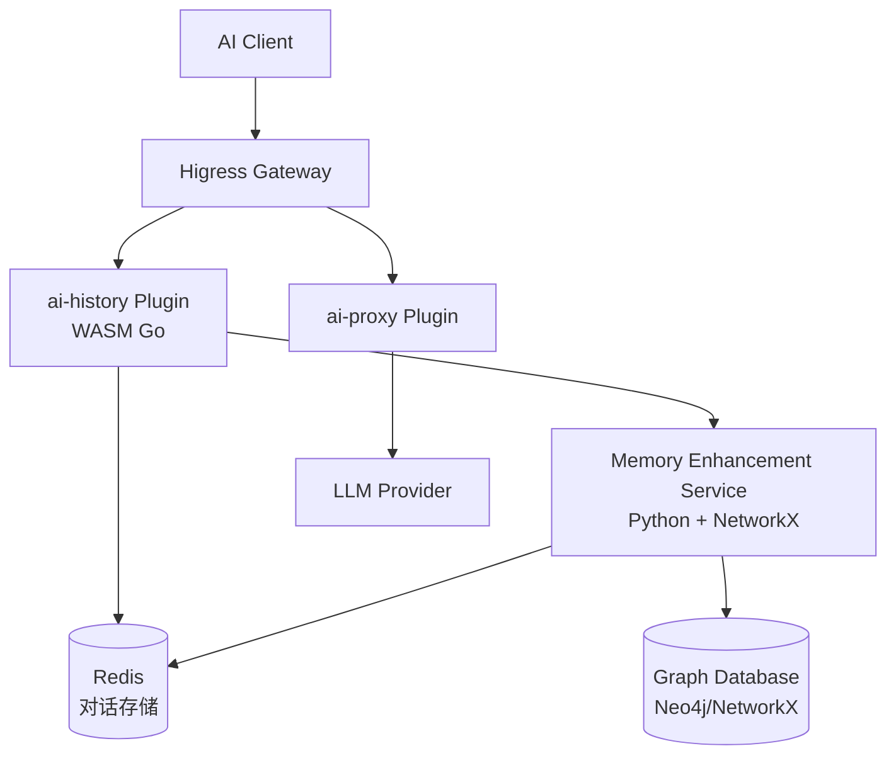

## 架构方案概述

由于 `ai-history` 是 WASM Go 插件 [1](#1-0) ,而 NetworkX 是 Python 库,您需要采用**外部服务 + 插件集成**的架构:



## 详细实现方案

### 1. 扩展 ai-history 插件

创建新插件 `ai-history-enhanced`,基于原有 `ai-history` 扩展 [2](#1-1) :

**关键修改点:**

- **添加 HTTP 调用**: 在 `onHttpStreamResponseBody` 处理完对话后,调用 Python 服务
- **配置扩展**: 添加 Memory Service 的服务地址配置

```go
type EnhancedConfig struct {
    RedisInfo
    KVExtractor
    // 新增:Memory Enhancement Service 配置
    MemoryServiceName string `yaml:"memoryServiceName" json:"memoryServiceName"`
    MemoryServicePort int    `yaml:"memoryServicePort" json:"memoryServicePort"`
    MemoryTimeout     int    `yaml:"memoryTimeout" json:"memoryTimeout"`
}
```

### 2. Python Memory Enhancement Service

创建独立的 Python 服务,提供 RESTful API:

**核心功能模块:**

#### 2.1 知识图谱构建 (NetworkX)

```python
import networkx as nx
import redis
from fastapi import FastAPI

class MemoryGraphService:
    def __init__(self):
        self.graph = nx.DiGraph()
        self.redis_client = redis.Redis(host='redis', port=6379)
    
    def build_conversation_graph(self, session_id: str):
        """从 Redis 读取对话历史,构建知识图谱"""
        history_key = f"higress-ai-history:{session_id}"
        conversations = self.redis_client.lrange(history_key, 0, -1)
        
        for conv in conversations:
            # 提取实体和关系
            entities = self.extract_entities(conv)
            relations = self.extract_relations(conv)
            
            # 添加到图中
            for entity in entities:
                self.graph.add_node(entity['id'], **entity)
            for rel in relations:
                self.graph.add_edge(rel['from'], rel['to'], **rel)
    
    def get_relevant_context(self, query: str, session_id: str, top_k: int = 5):
        """基于图结构检索相关上下文"""
        # 使用 PageRank 或其他图算法找到最相关的节点
        pagerank = nx.pagerank(self.graph)
        # 结合语义相似度排序
        relevant_nodes = self.semantic_search(query, pagerank, top_k)
        return self.format_context(relevant_nodes)
```

#### 2.2 API 接口设计

```python
app = FastAPI()
memory_service = MemoryGraphService()

@app.post("/api/v1/memory/enhance")
async def enhance_memory(request: MemoryRequest):
    """接收对话,更新知识图谱"""
    session_id = request.session_id
    question = request.question
    answer = request.answer
    
    # 更新图谱
    memory_service.add_conversation(session_id, question, answer)
    
    return {"status": "success"}

@app.post("/api/v1/memory/retrieve")
async def retrieve_context(request: RetrievalRequest):
    """检索增强上下文"""
    context = memory_service.get_relevant_context(
        query=request.query,
        session_id=request.session_id,
        top_k=request.top_k
    )
    return {"context": context}
```

### 3. 集成流程

#### 3.1 对话存储流程

在 `ai-history-enhanced` 插件的 `onHttpStreamResponseBody` 中 [3](#1-2) :

```go
func onHttpStreamResponseBody(ctx wrapper.HttpContext, config Config, chunk []byte, isLastChunk bool) {
    // 原有逻辑:存储到 Redis
    storeToRedis(ctx, config, chunk)
    
    // 新增:异步调用 Memory Service
    if isLastChunk {
        go func() {
            payload := map[string]interface{}{
                "session_id": getSessionId(ctx),
                "question": ctx.GetContext(QuestionContextKey),
                "answer": ctx.GetContext(AnswerContentContextKey),
            }
            
            httpCall(config.MemoryServiceName, config.MemoryServicePort, 
                     "/api/v1/memory/enhance", payload)
        }()
    }
}
```

#### 3.2 上下文检索流程

在 `onHttpRequestBody` 中 [4](#1-3) ,请求 LLM 前注入增强上下文:

```go
func onHttpRequestBody(ctx wrapper.HttpContext, config Config, body []byte) {
    sessionId := getSessionId(ctx)
    question := extractQuestion(body)
    
    // 调用 Memory Service 获取增强上下文
    enhancedContext := retrieveEnhancedContext(config, sessionId, question)
    
    // 注入到请求中
    modifiedBody := injectContext(body, enhancedContext)
    proxywasm.ReplaceHttpRequestBody(modifiedBody)
}
```

### 4. 部署配置

#### 4.1 Python Service 部署 (Kubernetes)

```yaml
apiVersion: apps/v1
kind: Deployment
metadata:
  name: memory-enhancement-service
  namespace: higress-system
spec:
  replicas: 3
  selector:
    matchLabels:
      app: memory-service
  template:
    metadata:
      labels:
        app: memory-service
    spec:
      containers:
      - name: memory-service
        image: your-registry/memory-service:latest
        ports:
        - containerPort: 8080
        env:
        - name: REDIS_HOST
          value: "redis.higress-system.svc.cluster.local"
        - name: NEO4J_URI
          value: "bolt://neo4j:7687"
---
apiVersion: v1
kind: Service
metadata:
  name: memory-service
  namespace: higress-system
spec:
  selector:
    app: memory-service
  ports:
  - port: 8080
    targetPort: 8080
```

#### 4.2 插件配置

```yaml
apiVersion: extensions.higress.io/v1alpha1
kind: WasmPlugin
metadata:
  name: ai-history-enhanced
  namespace: higress-system
spec:
  defaultConfig:
    redis:
      serviceName: redis.higress-system.svc.cluster.local
      servicePort: 6379
      timeout: 2000
    memoryServiceName: memory-service.higress-system.svc.cluster.local
    memoryServicePort: 8080
    memoryTimeout: 5000
    kvExtractor:
      requestBody: "messages.#(role==\"user\").content"
      responseBody: "choices.0.message.content"
  url: oci://your-registry/ai-history-enhanced:1.0.0
```

### 5. 构建和编译

#### 5.1 WASM 插件编译 [5](#1-4) 

```bash
cd plugins/wasm-go/extensions/ai-history-enhanced
GOOS=wasip1 GOARCH=wasm go build -buildmode=c-shared -o main.wasm .
```

#### 5.2 Docker 镜像构建 [6](#1-5) 

```dockerfile
# WASM 插件
FROM scratch
COPY main.wasm plugin.wasm

# Python 服务
FROM python:3.11-slim
WORKDIR /app
COPY requirements.txt .
RUN pip install -r requirements.txt
COPY . .
CMD ["uvicorn", "main:app", "--host", "0.0.0.0", "--port", "8080"]
```

## 生产环境考虑

### 性能优化

1. **异步处理**: Memory Service 调用使用异步,不阻塞主请求流 <cite />
2. **缓存策略**: 图谱查询结果缓存到 Redis,TTL 设置为 5 分钟
3. **批处理**: 积累多个对话后批量更新图谱

### 可靠性

1. **超时控制**: Memory Service 调用设置 5 秒超时 <cite />
2. **降级策略**: 如果 Memory Service 不可用,回退到原始 `ai-history` 逻辑
3. **重试机制**: HTTP 调用失败时重试 3 次

### 可观测性

1. **日志**: 记录所有 Memory Service 调用和图谱更新
2. **指标**: 监控图谱大小、查询延迟、命中率
3. **追踪**: 使用 OpenTelemetry 追踪完整请求链路

## Notes

这个方案将 Higress 的 WASM 插件能力与 Python 生态系统结合,通过外部服务实现复杂的图算法。<cite />关键是保持插件轻量,将计算密集型任务交给专门的服务处理。<cite />您也可以考虑使用 Neo4j 等专业图数据库替代 NetworkX 的内存图,以获得更好的持久化和查询性能。<cite />

Wiki pages you might want to explore:
- [Available Plugin Types (alibaba/higress)](/wiki/alibaba/higress#3.3)
- [AI Gateway Features (alibaba/higress)](/wiki/alibaba/higress#4)

### Citations

**File:** plugins/wasm-go/extensions/ai-history/main.go (L1-44)
```go
// File generated by hgctl. Modify as required.
// See: https://higress.io/zh-cn/docs/user/wasm-go#2-%E7%BC%96%E5%86%99-maingo-%E6%96%87%E4%BB%B6

package main

import (
	"encoding/json"
	"errors"
	"fmt"
	"net/url"
	"strconv"
	"strings"

	"github.com/higress-group/proxy-wasm-go-sdk/proxywasm"
	"github.com/higress-group/proxy-wasm-go-sdk/proxywasm/types"
	"github.com/higress-group/wasm-go/pkg/log"
	"github.com/higress-group/wasm-go/pkg/wrapper"
	"github.com/tidwall/gjson"
	"github.com/tidwall/resp"
)

const (
	QuestionContextKey       = "question"
	AnswerContentContextKey  = "answer"
	PartialMessageContextKey = "partialMessage"
	ToolCallsContextKey      = "toolCalls"
	StreamContextKey         = "stream"
	DefaultCacheKeyPrefix    = "higress-ai-history:"
	IdentityKey              = "identity"
	ChatHistories            = "chatHistories"
)

func main() {}

func init() {
	wrapper.SetCtx(
		"ai-history",
		wrapper.ParseConfigBy(parseConfig),
		wrapper.ProcessRequestHeadersBy(onHttpRequestHeaders),
		wrapper.ProcessRequestBodyBy(onHttpRequestBody),
		wrapper.ProcessResponseHeadersBy(onHttpResponseHeaders),
		wrapper.ProcessStreamingResponseBodyBy(onHttpStreamResponseBody),
	)
}
```

**File:** plugins/wasm-go/README.md (L9-32)
```markdown
使用以下命令可以快速构建 wasm-go 插件:

```bash
# NOTE: 如果你想在构建插件的时候设置额外的构建参数 EXTRA_TAGS
# 请更新 extensions/${PLUGIN_NAME} 插件目录对应的 .buildrc 文件
$ PLUGIN_NAME=request-block make build
```

<details>
<summary>输出结果</summary>
<pre><code>
DOCKER_BUILDKIT=1 docker build --build-arg PLUGIN_NAME=request-block \
                               -t request-block:20230223-173305-3b1a471 \
                               --output extensions/request-block .
[+] Building 67.7s (12/12) FINISHED

image:            request-block:20230223-173305-3b1a471
output wasm file: extensions/request-block/plugin.wasm
</code></pre>
</details>

该命令最终构建出一个 wasm 文件和一个 Docker image。
这个本地的 wasm 文件被输出到了指定的插件的目录下，可以直接用于调试。
你也可以直接使用 `make build-push` 一并构建和推送 image.
```

**File:** plugins/wasm-go/README_EN.md (L54-66)
```markdown
### step2. build and push docker image

A simple Dockerfile:

```Dockerfile
FROM scratch
COPY main.wasm plugin.wasm
```

```bash
docker build -t <your_registry_hub>/request-block:2.0.0 -f <your_dockerfile> .
docker push <your_registry_hub>/request-block:2.0.0
```
```
